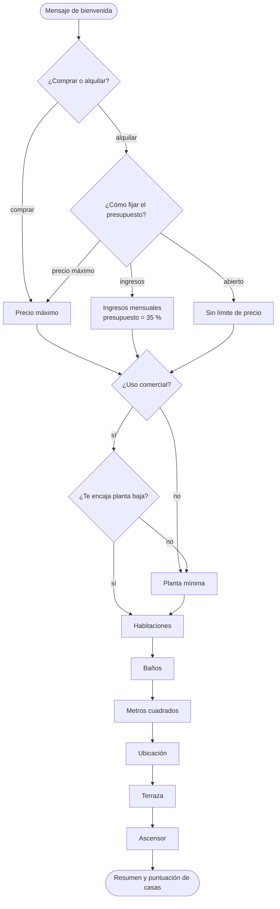
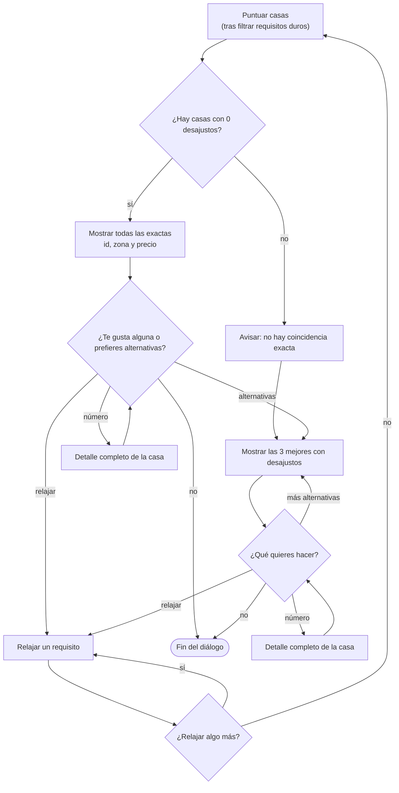
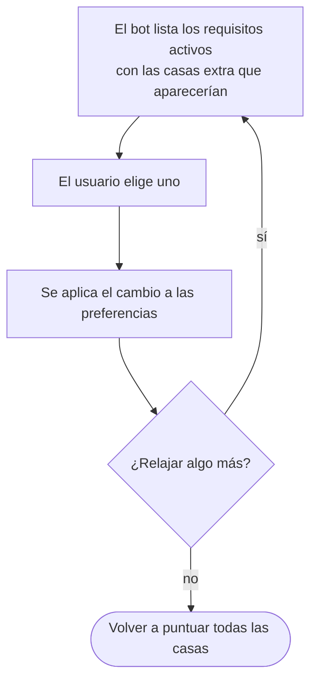

# Flujo de diálogo del chatbot de viviendas

Propuesta de la nueva versión del asistente (ejercicio 7). Los diagramas están en sintaxis Mermaid, que se visualiza en GitHub, VS Code (con la extensión de Mermaid) y la mayoría de editores de Markdown.

## 1. Cambios respecto a la versión actual

| Cambio | Antes | Ahora |
|---|---|---|
| Planta mínima | Se preguntaba casi al final | Se pregunta justo después del bloque de uso comercial, y todas las ramas convergen en un único nodo |
| Búsqueda | Función de búsqueda exacta, más menú de relajación, más «casas más próximas» | Una sola función de puntuación: las casas con 0 desajustos son las exactas |
| Resultados | Al ver una casa, la conversación terminaba | Se puede ver el detalle de varias casas y volver siempre a la lista |
| Relajar requisitos | Menú obligatorio con sintaxis `1,3` / `2:any` cuando no había resultados | Opcional: el usuario lo pide cuando quiere, un requisito cada vez |

## 2. Fase 1: preguntas

### Orden y condiciones de las preguntas

| Orden | `answer_key` | Pregunta | Se hace si… |
|---|---|---|---|
| 1 | `type` | ¿Comprar o alquilar? | Siempre |
| 2 | `budget_method` | ¿Cómo fijar el presupuesto? (precio, ingresos o abierto) | Alquila |
| 3 | `monthly_income` | Ingresos mensuales | Alquila y elige «ingresos» |
| 4 | `price` | Precio máximo | Compra, o alquila y elige «precio máximo» |
| 5 | `commercial_use` | ¿Uso comercial? | Siempre |
| 6 | `commercial_floor` | ¿Te encaja una planta baja? | Uso comercial = Sí |
| 7 | `floor` | Planta mínima | Siempre, salvo uso comercial = Sí y acepta planta baja |
| 8 | `bedrooms` | Habitaciones | Siempre |
| 9 | `bathrooms` | Baños | Siempre |
| 10 | `square_meters` | Metros cuadrados | Siempre |
| 11 | `location` | Ciudad o barrio | Siempre |
| 12 | `terrace` | Terraza | Siempre |
| 13 | `elevator` | Ascensor | Siempre |

Notas:

- Si el presupuesto es «abierto», `price` se guarda como `any` y no se pregunta ni ingresos ni precio.
- Si rechaza la planta baja, el bot lo comenta («Alright, then let's choose the floor yourself.») y pregunta la planta mínima con normalidad.
- Las preguntas 2 a 6 pueden cambiar las que vienen después, así que el flujo se reconstruye tras responderlas (`RECOMPUTE_FLOW_ON`).

## 3. Fase 2: puntuación y presentación de resultados

### Opciones del usuario en cada lista

| Respuesta | Efecto |
|---|---|
| Un número | Muestra el detalle completo de esa casa y vuelve a la misma lista |
| «alternativas» (solo en la lista de exactas) | Pasa a las 3 mejores casas con desajustos |
| «más alternativas» | Muestra las 3 siguientes de la lista ordenada |
| «relajar» | Pasa a la fase 3 |
| «no» o «ya está» | Termina el diálogo |

Si no hay ninguna casa exacta, el bot lo dice y pasa directamente a las alternativas, sin preguntar si quiere verlas.

### Requisitos duros (filtran, no puntúan)

Una casa que no cumpla alguno de estos requisitos no entra en la lista:

- `type` (comprar o alquilar).
- `commercial_use = Yes`: solo casas con uso comercial permitido.
- Planta baja, si es uso comercial y el usuario aceptó la recomendación.

### Desajustos y gravedad

Cada requisito que una casa no cumple es un desajuste, con una gravedad entre 0 (leve) y 1 (grave).

| Requisito | Se considera desajuste si… | Gravedad |
|---|---|---|
| Presupuesto | El precio supera el tope (precio directo o 35 % de ingresos) | `min(1, (precio - tope) / tope)` |
| Metros cuadrados | La casa se sale del margen: 10 m² menos o 25 m² más de lo pedido | Exceso sobre el margen / 25, máximo 1 |
| Planta mínima | La casa está por debajo de la planta pedida | `(pedida - real) / max(pedida, 1)`, máximo 1 |
| Habitaciones y baños | El número no coincide exactamente | `\|diferencia\| / 2`, máximo 1 |
| Ubicación | La zona es distinta | 0,6 fijo |
| Terraza y ascensor | Los pidió y la casa no los tiene | 0,3 fijo |

Una casa es exacta cuando no tiene ningún desajuste. El resto se ordena por:

1. Número de desajustos (menos es mejor).
2. Suma de gravedades.
3. Id de la casa, para desempatar.

## 4. Fase 3: relajar requisitos

El usuario pide «relajar» desde cualquier lista de resultados.

| Requisito | Al relajarlo |
|---|---|
| Presupuesto | Sube el tope un 10 % (`BUDGET_RELAXATION_PERCENT`) |
| Habitaciones, baños, ubicación | Pasa a `any` |
| Metros cuadrados | Pasa a `any` |
| Planta mínima | Pasa a `any` |
| Terraza, ascensor | Pasa a `any` |
| Planta baja (uso comercial) | Pasa a «cualquier planta» |
| Tipo de operación, uso comercial = Sí | No se pueden relajar |

Junto a cada requisito se indica cuántas casas más aparecerían: son las que solo fallan en ese campo, y se obtienen de la misma lista de desajustos sin volver a buscar. Los cambios son acumulativos: lo ya relajado sigue relajado en las rondas siguientes.

## 5. Comandos disponibles en cualquier momento

| Comando | Efecto | Dónde |
|---|---|---|
| `back`, «go back», «I made a mistake» | Pide confirmación y vuelve a la pregunta anterior | Solo en la fase de preguntas |
| `q`, `quit`, `exit` | Pide confirmación y sale del chat | Todas las fases |
| `any`, «I don't care», «no preference» | Guarda la preferencia como `any` | Fase de preguntas |
| «I don't know», `idk`, «not sure» | Guarda `any` y se lo dice al usuario | Fase de preguntas |

## 6. Decisiones pendientes

1. Si el usuario relaja el presupuesto varias veces, ¿cada vez sube otro 10 % o solo se permite una vez?
2. Tras ver las alternativas, ¿debe poder volver a la lista de casas exactas? Propuesta: sí, con la palabra «exactas».
3. Cuando se acaban las alternativas con «más alternativas», ¿basta con avisar y volver a la lista, o se ofrece relajar?
4. ¿Debe funcionar `back` también en la fase de resultados? Hoy solo funciona en la de preguntas.
